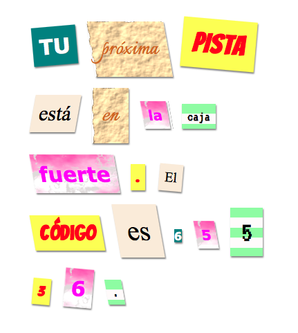
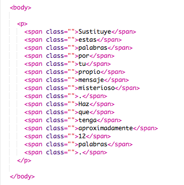
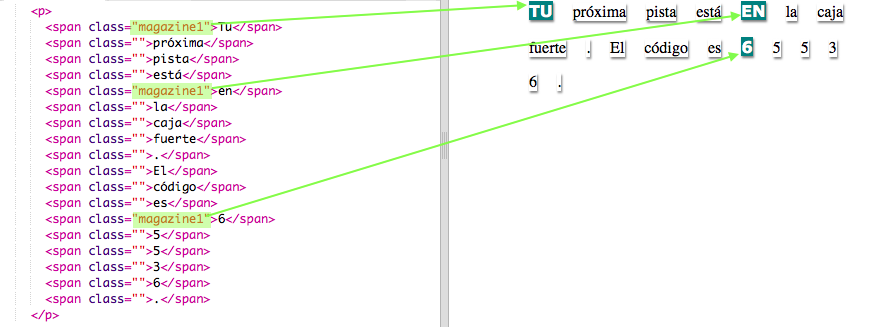
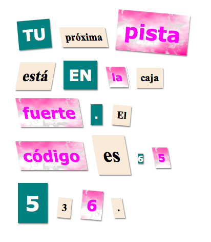
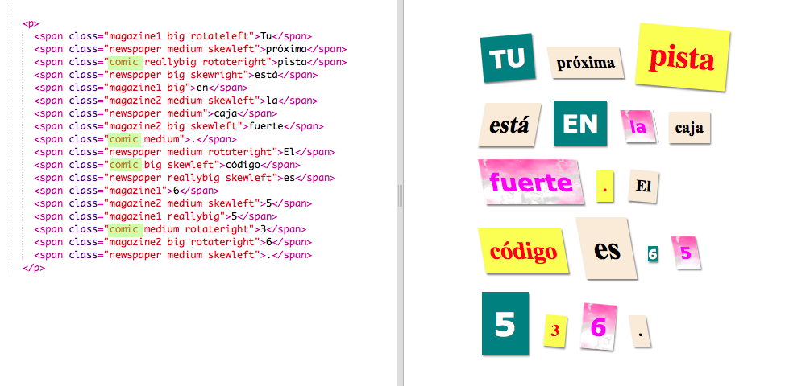
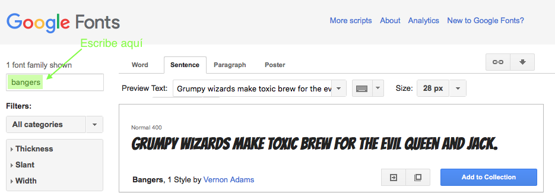
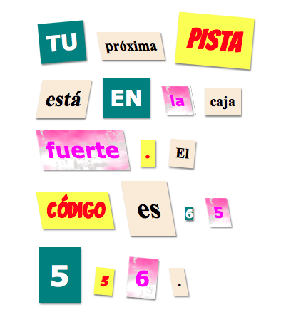
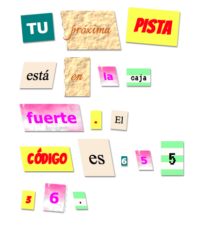

# Einführung {.intro}

In diesem Projekt wirst du einen geheimnisvollen Brief produzieren, der so aussehen wird, als ob jedes einzelne Wort aus einer anderen Zeitung / Zeitschrift, bzw. aus einem Comic oder aus einer anderen Art von Broschüre ausgeschnitten worden ist. 

# Schritt 1: Wähle deine Mitteilung aus {.activity}

In Filmen und Büchern werden geheimnisvolle Briefe dazu benutzt, um geheime Mitteilungen zu verschicken. 

## Aufgaben-Checkliste { .check}

+ Denk dir eine geheimnisvolle Botschaft aus. 12 Wörter sind hierfür ungefähr die richtige Länge. Wenn dir gerade keine konkrete Botschaft einfallen sollte, kannst du dieses Beispiel hier benutzen: 'Your next clue is in the safe. The code is 65536.' (Dein nächster Hinweis liegt im Safe. Der Code ist 65536.)

+ Mache dir entweder eine Notiz von dieser Botschaft oder lerne sie auswendig. 

# Schritt 2: Bearbeite deine Botschaft {.activity}

Lass uns deine Botschaft auf der Webseite platzieren.

## Aufgaben-Checkliste { .check}

+ Dieses Trinket öffnen: <a href="http://jumpto.cc/web-letter" target="_blank">jumpto.cc/web-letter</a>. 

	Das Projekt sollte so aussehen:

	

+ Das `
` “Paragraph” (Absatz) Tag wird im 'Happy Birthday' Projekt eingeführt. Das `` (umspannen) Tag wird benutzt, um kleinere Textstücke in einem Absatz zusammen zu gruppieren, damit wir sie grafisch bearbeiten können, bzw. den Stil ändern können. 

## Aufgaben-Checkliste { .check}

+ Ändere die Worte in deiner Botschaft, indem du ein Wort in jedes `` Tag setzt. Du wirst die `` Tags entweder hinzufügen oder entfernen müssen, wenn deine Botschaft unterschiedlich lang ist. 

## Aufgaben-Checkliste { .check}

+ Klicke auf die “Run” (laufen lassen) Taste, um dein Trinket zu testen.

	Wenn du dir die Worte ansiehst, kannst du sehen, dass sie grafisch so dargestellt wurden, als ob sie auf die Seite geklebt worden sind.

# Schritt 3: Nutzung der Klassenstile {.activity}

## Aufgaben-Checkliste { .check}

+ Hast du die `class=""` (Klasse) in den `` Tags bemerkt? Du kannst dies benutzen, um mehr als eine Sache auf die gleiche Art und Weise zu stylen, bzw. grafisch darzustellen. 

+ Füge die `magazine1` (Zeitschrift 1) Klasse zu ein paar deiner `` Tags hinzu und teste deine Webseite.

## Aufgaben-Checkliste { .check}

+ Du kannst mehr als eine Klasse zu einem Element hinzufügen. Du musst dazwischen nur einen Freiraum lassen. Füge die `big` (große) Klasse zu einer deiner `` Tags hinzu. Teste deine Seite. 

## Projekt speichern {.save}

## Aufgabe: Gestalte deinen Botschaftsstil {.challenge}

Benutze die vorgegebenen Stilrichtungen, damit deine Botschaft wie ein geheimnisvoller Brief aussieht. 

Füge diese Klassen zu deinen `` Tags hinzu: 

+ `newspaper` (Zeitung), `magazine1` (Zeitschrift 1), `magazine2` (Zeitschrift 2)

+ `medium` (mittel), `big` (groß), `reallybig` (riesig groß)

+ `rotateleft` (nach links drehen), `rotateright` (nach rechts drehen)

+ `skewleft` (schräg nach links kippen), `skewright` (schräg nach rechts kippen)

Füge nicht mehr als eins von jeder Zeile zu einem spezifischen `` Tag hinzu.

So könnte dein Brief u. U. aussehen:

## Projekt speichern {.save}

# Schritt 4: Klassen bearbeiten  {.activity}

## Aufgaben-Checkliste { .check}

+ Klicke auf den __'style.css'__ Reiter. Finde den Stil für die `newspaper` (Zeitung) CSS Klasse, die du benutzt hast.

+ Beachte bitte, dass ein Punkt '.' vor dem Namen der Klasse in der CSS-Datei gesetzt wird, nicht aber im `` Tag deines HTML Dokuments.

+ Schau dir jetzt die anderen CSS Klassen an, die du benutzt hast, um deinen geheimnisvollen Brief grafisch zu gestalten. Kannst du Folgendes finden:

	+ Wie der `magazine1` (Zeitschrift 1) Stil den Text zu „durchgehend in Großbuchstaben“ ändert?.

	+ Wie der `magazine2` (Zeitschrift 2) Stil ein Bild hinter den Text legt?

+ Was passiert, wenn du das `background-image` (Hintergrundbild) für `magazine2` (Zeitschrift 2) zu `canvas.png` (Leinwand) änderst? Wenn du das `pink-pattern.png` (rosa Muster) lieber magst, kannst du es wieder dahin zurückverwandeln. 

Du kannst auch die Farben in den Zeitschriftstilen ändern, wenn du magst.

+ Finde den CSS-Code, der benutzt wird, um deine Worte zu drehen und in die Schräglage (ins Kippen) zu bringen:

Probiere mal, die Zahlen zu ändern, um verschiedene Effekte herzustellen und teste dann jedes Mal deine Seite aus. 

# Schritt 5: Eine neue Klasse erzeugen  {.activity}

Lass uns einen Stil erzeugen, der aussieht, als ob er aus einem Comic ausgeschnitten wurde. <a href="http://jumpto.cc/web-fonts" target="_blank">jumpto.cc/web-fonts</a> bietet jede Menge Schriftarten, die man gratis benutzen kann. 

## Aufgaben-Checkliste { .check}

+ Füge eine `comic` Klasse zur __style.css__ Datei hinzu. Nach `magazine2` (Zeitschrift 2) ist ein günstiger Platz. Vergiss nicht den Punkt for dem Klassennamen! 

Keine Bange, falls du eine Warnmeldung erhältst, in der steht: 'The Rule is empty' (Der Maßstab ist leer.), du wirst dies als nächstes beheben. 

+ Füge jetzt den CSS-Code zur Comic CSS Klasse hinzu. Du kannst die verschiedenen Farben benutzen, wenn du willst. Es gibt eine Liste mit jeder Menge an Farben unter <a href="http://jumpto.cc/colours" target="_blank">jumpto.cc/colours</a>.

+ Benutze den Comic-Stil in manchen der `` Tags in deinem HTML Dokument und teste deine Seite:

+ Jetzt kannst du eine tolle Schriftart hinzufügen. Öffne einen neuen Browser-Reiter, bzw. Fenster. Gehe zu <a href="http://jumpto.cc/web-fonts" target="_blank">jumpto.cc/web-fonts</a> und suche nach __'bangers'__:

+ Klicke auf den “Quick-use” (Schnellnutzung) Knopf:

+ Es wird dann eine neue Seite geladen. Scroll-Down bis du Folgendes siehst:

und kopiere den markierten Code. 

+ Füge den `<link>` Code ein, den du soeben von Google-Schriftarten in den `<head>` (Titel) deiner Webseite kopiert hast:

Dies ermöglicht dir, die Bangers-Schriftart auf deiner Webseite zu benutzen. 

+ Gehe zurück zu Google-Schriftarten und Scroll-Down weiter die Seite runter, kopiere dann den Schriftfamilien-Code:

+ Gehe jetzt zu deiner __'style.css'__ Datei in Trinket zurück und füge den Schriftfamilien-Code in deinen Comic-Stil ein:

+ Teste deine Webseite. Das Ergebnis sollte in etwa so aussehen: 

## Projekt speichern {.save}

## Aufgabe: Erstelle einen Stil, der wie vom Computer ausgedruckt aussieht {.challenge}

Erstelle einen altmodischen, wie vom Computer ausgedruckten Stil und wende diesen Stil bei manchen der Worte an:

Du wirst Folgendes benötigen:

+ Die `VT323` Schriftfamilie von <a href="http://jumpto.cc/web-fonts" target="_blank">jumpto.cc/web-fonts</a>. Schau zurück zu Schritt Nr. 5, falls du eine Erinnerungshilfe benötigst, wie man Google-Schriftarten benutzt. 

+ Das `computer-printout-paper.png` (wie vom Computer ausgedruckte) Hintergrundbild. Schau zurück zu Schritt Nr. 4, falls du eine Erinnerungshilfe benötigst, wie man Hintergrundbilder benutzt. 	

## Aufgabe: Erstelle deinen eigenen Stil {.challenge}

Stelle jetzt deinen eigenen Stil her und lasse deinen geheimnisvollen Brief noch interessanter aussehen. Benutze den CSS-Code, den du hier gelernt hast bei deinen vorherigen Projekten und schau dir diese Beispiele in __style.css__ an, um weitere Tipps und Ideen zu erhalten. 

Hier ist ein Beispiel:

Du kannst die Bilder, die zur Nutzung zur Verfügung stehen, sehen, wenn du in Trinket auf den Bilder-Reiter klickst. 
Probiere mal die Hintergrundbilder mit Hilfe eines der beigefügten Bilder einzustellen: 

+ `rough-paper.png` (rauhes Papier)

+ `canvas.png` (Leinwand)

Falls du ein Trinket Konto hast, kannst du auch eigene Bilder hochladen, wie du es bereits im 'Tell a Story' (Erzähle eine Geschichte) Projekt getan hast. 

Finde die Schriftarten, die dir gefallen unter <a href="http://jumpto.cc/web-fonts" target="_blank">jumpto.cc/web-fonts</a> und kopiere ihren `<link>` (Link) sowie den CSS-Code in dein Trinket, um sie benutzen zu können. 

## Projekt speichern {.save}
