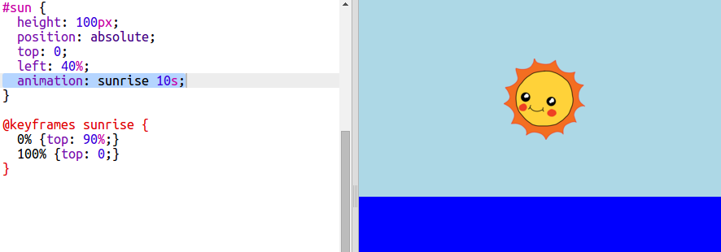

---
title: Sonnenaufgang
description: Erstelle einen animierten Sonnenaufgang. 
layout: project
notes: "Sunrise - notes.md"
...

# Einführung { .intro}

In diesem Projekt lernst du, wie man CSS benutzt, um einen animierten Sonnenaufgang zu erstellen.

<div class="trinket">
  <iframe src="https://trinket.io/embed/html/abcc0284a3?outputOnly=true&start=result" width="600" height="400" frameborder="0" marginwidth="0" marginheight="0" allowfullscreen>
  </iframe>
  
</div>

# Schritt 1: Die Sonne herstellen { .activity}

Lass uns damit beginnen, ein Bild für die Sonne hinzuzufügen und diese mit etwas CSS-Code zu positionieren.

## Aufgaben-Checkliste { .check}

+ Dieses Trinket öffnen: <a href="http://jumpto.cc/web-sunrise" target="_blank">jumpto.cc/web-sunrise</a>. 

    Das Projekt sollte so aussehen:

	

+ Schau in den `body` (Hauptteil) deiner `index.html` (Inhaltsverzeichnis) Datei und du wirst dort die `div` Elemente für den Himmel und das Meer finden.

    ```
    <div id="sky">
    </div>
    
    <div id="sea">
    </div>
    ```

+ Diesem Projekt wurde bereits ein Bild für die Sonne hinzugefügt. 

    Füge das Bild in deiner Sonne `div` inklusive einer ID ein, damit du es grafisch gestalten kannst:

    

+ Wow! Das Bild ist ja riesig! Gehe zu `style.css` und füge den CSS-Code hinzu, um die Bildhöhe einzustellen:

    

    Bitte beachte, dass die Breite automatisch eingestellt wird, damit die Proportionen gleich bleiben. 

+ Zum Schluss wollen wir noch etwas Code hinzufügen, um die Sonne zu positionieren:

    


## Projekt speichern {.save}

# Schritt 2: Den Sonnenaufgang animieren { .activity}

Um den Sonnenaufgang  zu animieren, musst du definieren, wie sich die Sonne bewegt und wie lange es dauern soll, bis sie aufgeht.

Damit du dies tun kannst, musst du eine Liste von sog. __Keyframes__, bzw. Schlüsselbildern definieren. Jeder „Keyframe“ definiert die CSS-Eigenschaften eines Elements zu einem bestimmten Zeitpunkt der Animation. 

## Aufgaben-Checkliste { .check}

+ Als erstes musst du `@keyframes` (Schlüsselbilder) benutzen, um eine neue Animation namens Sonnenaufgang zu erstellen. 

    Füge diesen CSS-Code zum Ende deiner `style.css` Datei hinzu:

    ```
    @keyframes Sonnenaufgang {
        0% {oben: 90%;}
        100% {oben: 0;}
    }
    ```

    Dieser Code teilt der Sonne mit, wo sie zu Beginn (`0%`) und zum Ende (`100%`) der Animation positioniert ist.

    Da die Sonne sich im Himmel `div` befindet, sind die `top` (oben) und `left` (links) Positionen, die du gibst, innerhalb „zum Himmel“, wobei `top: 100%` (oben 100%) die Unterseite des Himmels bedeutet und nicht die Unterseite deiner Webseite.


+ Jetzt, wo du eine `sunrise` (Sonnenaufgang) Animation erstellt hast, musst du nur noch der Sonne mitteilen, diese zu benutzen! 

    Füge den markierten Code zum CSS deiner Sonne hinzu:

    

    Dies teilt der Sonne mit, 10 Sekunden damit zu verbringen, einen Sonnenaufgang zu animieren.

+ Um diese Animation erneut laufen zu lassen, brauchst du im Trinket einfach nur auf **Autorun** (automatisch laufen lassen) zu klicken. 

## Projekt speichern {.save}

##Aufgabe: Diagonale Animation {.challenge}
Kannst du den Code zu deiner `sunrise` (Sonnenaufgang) Animation hinzufügen, damit deine Sonne unten links vom Himmel aufgeht und diagonal zu ihrer Position ungefähr oben in der Mitte gelangt?

Du kannst die `left` (links) Eigenschaft hierfür benutzen, zum Beispiel:

```
links: 40%;
```


## Projekt speichern {.save}


# Schritt 3: Unendliche Animation { .activity}

Lass es uns so einstellen, dass sich die Animation unendlich wiederholt.

## Aufgaben-Checkliste { .check}

+ Wenn du willst, dass die Sonne auf- und wieder untergeht, brauchst du einfach nur weitere „Keyframes“ zu deiner Animation hinzuzufügen:

    ```
    @keyframes Sonnenaufgang {
        0%   {oben:90%; links:0;}
        33%  {oben:0; links:40%; }
        66%  {oben:0; links:40%; }
        100% {oben:90%; links:80%; }
    }
    ```

    Das bedeutet, dass die Animation mit der Sonne im unteren Teil des Himmels beginnt und dort auch endet und von 33% bis 66% der Animation oben bleibt.

+ Jetzt musst du nur noch das Wort `infinite` (unendlich) zur `#sun` (Sonne) Animation hinzufügen, damit sie für immer in einer Schleife ist:

    

+ Teste deine Animation. Geht die Sonne immer wieder erneut auf und unter? 


## Projekt speichern {.save}

# Schritt 4: Den Himmel animieren { .activity}

Die Animation gilt nicht nur für Bewegungen. Lass uns den Himmel so animieren, dass er nachts dunkel wird.

## Aufgaben-Checkliste { .check}

+ Füge eine Animation namens `sky` (Himmel) zu deinem CSS hinzu:

    ```
    @keyframes Himmel {
        0% {Hinergrund: schwarz }
        100% {Hintergrund: hellblau}
    }
    ```

    Beachte bitte, dass du diesmal die Farbe des Himmels animierst und nicht die Position.

+ Füge den Code zu deinem Himmel hinzu, um ihm mitzuteilen, deine neue Animation zu benutzen:

    ```
    Animation: Himmel 10s;
    ```

    

+ Klicke auf **Autorun**, um deine Animation zu testen. 

## Projekt speichern {.save}

##Aufgabe: Verbessere den Himmel {.challenge}

Kannst du die Animation des Himmels ändern, damit er zur Sonne passt und tagsüber blau bleibt und nachts, bei Sonnenuntergang, schwarz wird? Lasse den Himmel auch für immer in einer Schleife bleiben. 


##Aufgabe: Noch mehr Animationen {.challenge}

Kannst du ein weiteres Bild animieren? Du kannst die Position, die Farbe, die Form, die Größe, die Opaziät (Durchsichtigkeit) oder alles andere mögliche, das dir einfällt, animieren. Probiere auch mal, ob du die Länge der Zeit, in der deine Animationen laufen sollen, ändern kannst. 

Für jedes Ding, das du animieren willst, musst du:

+ es mit einer ID in dein HTML mit einbeziehen
+ einen Stil für die ID hinzufügen
+ eine „@keyframes” Regel aufstellen
+ Benutze `animation:` in dem Stil, um die Animation zu benutzen, die du mit „@keyframes“ definiert hast. 

Klicke auf das Bildsymbol, um die Bilder zu sehen, die in diesem Projekt mit enthalten sind:


Du kannst, wenn du willst, auch deine eigenen Bilder hochladen. 

Vergiss nicht, dass du Dinge auch im Meer, bzw. im Himmel platzieren kannst:


In dem Beispiel hier benutzt der Regenbogen die Opazität für diesen Ausblendungseffekt:

```
@keyframes ausblenden {
  0%   {Opazität: 0;}
  50%  { Opazität: 100;}
  66%  { Opazität: 0;}
  100%   {Opazität: 0;}
}
```

Das Boot benutzt eine negative Startposition, damit du es für einen gewissen Teil der Animation nicht sehen kannst:

```
 @keyframes links-rechts {
  0%    {links:-50%;}
  100%  {links:200%;}
}
```

## Projekt speichern {.save}
