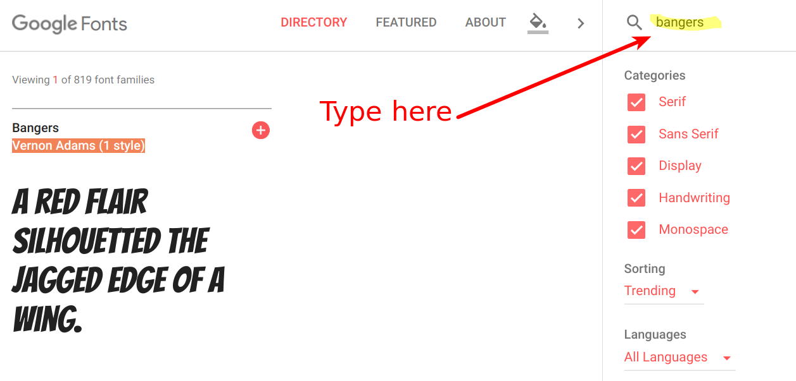
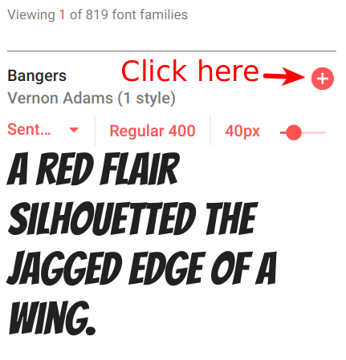
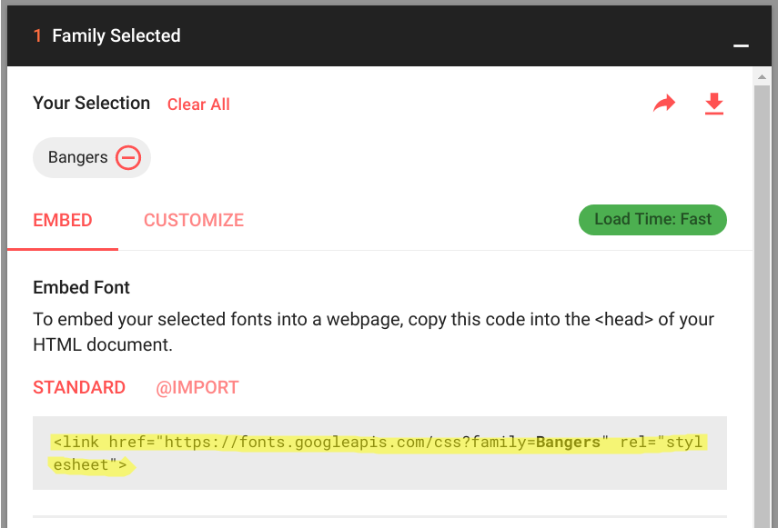

# Introduction {.intro}

In this project, you'll create a mystery letter that looks like each word has been cut from a different newspaper, magazine, comic or other source. 

# Step 1: Choose Your Message {.activity}

Mystery letters are used in films and books to send secret messages. 

## Activity Checklist { .check}

+ Think of a mystery message, 12 words is about the right length. If you can't think of a message you can use the example: 'Your next clue is in the safe. The code is 65536.'

+ Either make a note of your message or remember it. 

# Step 2: Editing Your Message {.activity}

Let's get your message onto a webpage.

## Activity Checklist { .check}

+ Open this trinket: <a href="http://jumpto.cc/web-letter" target="_blank">jumpto.cc/web-letter</a>. 

	The project should look like this:

	

+ The `
` paragraph tag is introduced in the 'Happy Birthday' project. The `` tag is used to group smaller pieces of text inside a paragraph so that we can style them. 

## Activity Checklist { .check}

+ Change the words to your message by putting one word in each ``. You will need to add or remove `` tags if your message is a different length. 

## Activity Checklist { .check}

+ Click the Run button to test your trinket.

	If you look at the words, you can see that they’ve been styled to look like they’ve been stuck onto the page.

# Step 3: Using Class Styles {.activity}

## Activity Checklist { .check}

+ Did you notice the `class=""` in the `` tags? You can use this to style more than one thing in the same way. 

+ Add the `magazine1` class to a few of your `` tags and test your webpage.

## Activity Checklist { .check}

+ You can add more than one class to an element. Just leave a space in between. Add the `big` class to one of your `` tags. Test your page. 

## Save Your Project {.save}

## Challenge: Style Your Message {.challenge}

Use the provided styles to make your message look like a mystery letter. 

Add these classes to your `` tags: 

+ `newspaper`, `magazine1`, `magazine2`

+ `medium`, `big`, `reallybig`

+ `rotateleft`, `rotateright`

+ `skewleft`, `skewright`

Don't add more than one from each line to a particular ``.

This is how your letter could look:

## Save Your Project {.save}

# Step 4: Editing Classes  {.activity}

## Activity Checklist { .check}

+ Click on the __'style.css'__ tab. Find the style for the `newspaper` CSS class that you have been using.

+ Notice that there's a dot (full stop) '.' before the name of the class in the CSS file but not in the `` tag in your HTML document.

+ Now look at the other CSS classes that you used to style your mystery letter. Can you find:

	+ How the `magazine1` style changes the text to all uppercase (capital) letters.

	+ How the `magazine2` style puts an image behind the text.

+ What happens if you change the `background-image` for `magazine2` to `canvas.png`? If you prefer `pink-pattern.png` you can change it back. 

You can also change the colours in the magazine styles if you like.

+ Find the CSS used to rotate and skew (tilt) your words:

Try changing the numbers to create different effects and then testing your page. 

# Step 5: Create a New Class  {.activity}

Let's create a style that looks like it has been cut from a Comic. <a href="http://jumpto.cc/web-fonts" target="_blank">jumpto.cc/web-fonts</a> provides loads of fonts that are free to use. 

## Activity Checklist { .check}

+ Add a `comic` class in the __style.css__ file. After `magazine2` is a good place. Don't forget the dot in front of the class name. 

Don't worry if you get a warning saying that 'The Rule is empty', you'll fix that next. 

+ Now add some CSS to the comic CSS class. You can use different colours if you like. There's a list of loads of colours at <a href="http://jumpto.cc/colours" target="_blank">jumpto.cc/colours</a>.

+ Use the comic style in some of the `` tags in your HTML document and test your page:

+ Now you can add a fun font. Open a new browser tab or window. Go to <a href="http://jumpto.cc/web-fonts" target="_blank">jumpto.cc/web-fonts</a> and search for __'bangers'__:

+ Click on the Quick-use button:

+ A new page will load. Scroll down until you see:

and copy the highlighted code. 

+ Paste the `<link>` code that you just copied from Google fonts into the `<head>` of your webpage:

This allows you to use the Bangers font in your webpage. 

+ Return to Google fonts and scroll further down the page and copy the font-family code:

+ Now go back to your __'style.css'__ file in trinket and paste the font-family code into the comic style:

+ Test your webpage. The result should look something like this: 

## Save Your Project {.save}

## Challenge: Create A Computer Printout Style {.challenge}

Create an old-fashioned computer printout style and apply it to some of the words:

You will need:

+ The `VT323` font family from <a href="http://jumpto.cc/web-fonts" target="_blank">jumpto.cc/web-fonts</a>. Look back at Step 5 if you need a reminder on using Google fonts. 

+ The `computer-printout-paper.png` background image. Look back at Step 4 if you need a reminder on using background images. 	

## Challenge: Create Your Own Styles {.challenge}

Now create your own class styles and make your mystery letter even more interesting. Use the CSS that you have learnt in previous projects and look at the examples in __style.css__ for ideas. 

Here's an example:

You can see the images that are available to use by clicking on the Images tab in trinket.
Try setting image backgrounds using one of the included images: 

+ `rough-paper.png`

+ `canvas.png`

If you have a trinket account, you can upload images of your own as you did in the 'Tell a Story' Project. 

Find fonts that you like on <a href="http://jumpto.cc/web-fonts" target="_blank">jumpto.cc/web-fonts</a> and copy their `<link>` and CSS code into your trinket to use them. 

## Save Your Project {.save}
