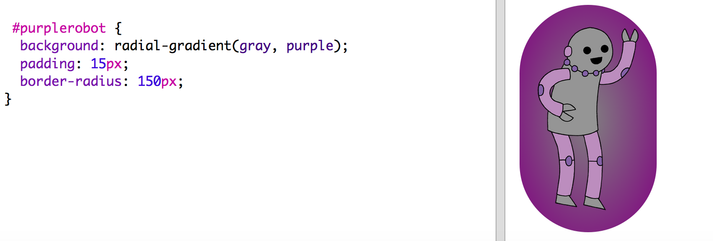
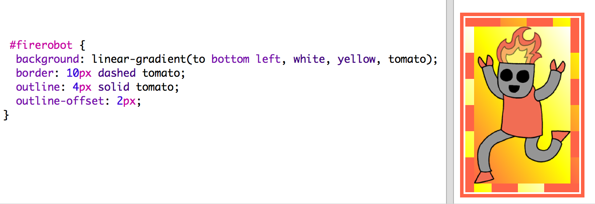
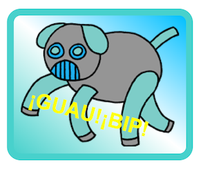

# Introducción {.intro}

En este proyecto, vamos a crear un montón de pegatinas divertidas que podrás usar para decorar páginas web. Aprenderás a usar degradados para hacer que las pegatinas sean muy chulas. 

# Paso 1: Crear una pegatina con degradado lineal {.activity}

Un degradado en un cambio progresivo de un color a otro. Los degradados se pueden usar para crear efectos alucinantes. Vamos a aprender a usarlos para crear pegatinas que podrás usar en tus páginas web. 

+ Abre este trinket: <a href="http://jumpto.cc/web-stickers" target="_blank">jumpto.cc/web-stickers</a>. Si estás leyendo este proyecto en línea, también puedes usar el trinket incrustado que encontrarás a continuación. 

  <iframe src="https://trinket.io/embed/html/af0ea6fa35" width="100%" height="400" frameborder="0" marginwidth="0" marginheight="0" allowfullscreen>
  </iframe>

+ Vamos a hacer una pegatina en la que ponga 'Yo <3 Programar'. 

	Escribe un `
` con la class (categoría) `sticker` y el id `programar` para que le puedas dar estilo: 

	

+ Vaya... ¿Te has dado cuenta de que da un error? Eso es porque '<' es un carácter especial en HTML. En lugar de '<' tendrás que usar el código especial `&lt;`. 

	Cambia tu código y usa `&lt;` para que desaparezca el error. 

	

	` ` introduce una nueva línea. 

+ Ahora vamos a hacer que la pegatina parezca más interesante. 

	Cambia a la pestaña `style.css`. Verás que la categoría `.sticker` ya está creada. Con esto, las pegatinas se mostrarán en la página y su contenido se centrará.

	Recuerda que has añadido el id `programar` a tu pegatina. Al final de `style.css` incluye este código para dar estilo al texto:

	

+ A continuación puedes añadir un degradado para el fondo de la pegatina. Un degradado lineal cambia de un color a otro a lo largo de una línea recta.

	Este degradado cambiará de rojo en la parte superior a magenta en la parte inferior. Añade el código de degradado al estilo `programar`:

	

+ Puedes mejorar el resultado si añades relleno ("padding") y esquinas redondeadas. 

	Escribe el código resaltado:

	

	El estilo `padding` añade relleno de 50px en la parte superior en inferior y 30px a la derecha e izquierda. 

## Guarda tu proyecto{.save}

# Paso 2: Crea una pegatina con degradado radial {.activity}

Los degradados también pueden cambiar el color desde el centro hacia los extremos. Estos se llaman degradados radiales. 

+ Vamos a crear una pegatina con el texto `HTML & CSS.`  `&` es otro carácter que necesita codificación en HTML. El código es `&amp;`.

	Incluye el código resaltado para crear una nueva etiqueta: 

	

+ Después, cambia a la pestaña `style.css` y añade estilo a la nueva pegatina:

	

	El código `text-shadow` añade una sombra que se extiende 2px por debajo y a la derecha del texto para hacer que este destaque. 

+ Vamos a por el degradado. Esta vez vamos a usar un degradado radial. El color cambiará de amarillo en el centro, pasando por naranja, y finalmente a rojo. 

	

	Fíjate que los degradados pueden incluir varios colores, no sólo dos. 

+ La pegatina mejorará mucho con un poco de relleno y las esquinas redondeadas. 

	Añade el código resaltado:

	

## Guarda tu proyecto {.save}

##Desafío: Crea tu propia pegatina con degradado {.challenge}

Ahora haz tu propia pegatina con degradado. Prueba degradados lineales y radiales usando varios colores de HTML. 

Tendrás que:

+ Añadir un `
` con el texto de tu pegatina en `index.html` y asignarle la categoría `sticker` y un nuevo `id`.
+ Añadir estilo al `id` que escojas en `style.css`. Podrías copiar uno de los estilos de etiqueta que ya has creado y editarlo. 

Aquí encontrarás una lista con todos los nombres de colores que puedes usar: [jumpto.cc/web-colours](http://jumpto.cc/web-colours), entre los que se encuentran nombres como `tomato` (tomate), `firebrick` (ladrillo), y `peachpuff` (melocotón).

si quieres cambiar el color del texto, puedes usar `color:`.

Este es un ejemplo de lo que puedes hacer con varios colores en un degradado lineal:

## Guarda tu proyecto {.save}

# Paso 3: Crea una pegatina con degradado que contenga una imagen {.activity}

También puedes crear una pegatina con degradado usando una imagen. Si usas una imagen con el fondo transparente, el degradado se verá a través de la imagen. 

+ Primero, vamos a crear una pegatina que incluya una imagen. 

	Tu proyecto incluye una imagen que se llama `purplerobot.png`.

	Añade el código resaltado a `index.html`:

	

	Puedes ajustar la `altura` (height) para cambiar el tamaño de la imagen, el ancho cambiará automáticamente. 

+ A continuación, añade el código de estilo para crear un fondo degradado en tu pegatina con imagen:

	

## Guarda tu proyecto {.save}

##Desafío: Crea tu propia pegatina con una imagen  {.challenge}

Ahora vas a crear tu propia pegatina de imagen con efecto degradado. 

Tendrás que:

+ Añadir en `index.html` un nuevo `
` de pegatina que incluya una imagen. 
+ Añadir la categoría `sticker` y un nuevo id al div de pegatina.
+ Crear un estilo para el nuevo id con degradado y relleno. 

El proyecto incluye una serie de imágenes de robots. Haz clic en el icono de imágenes para ver cuáles están disponibles. 

Este es un ejemplo de una pegatina con imagen y degradado lineal:

## Guarda tu proyecto {.save}

# Paso 4: Degradados horizontales {.activity}

Los degradados también pueden ser horizontales además de verticales. 

+ Vamos a crear una nueva pegatina con imagen. 

	Esta vez vamos a usar la imagen `greenrobot.png`. Añade este código a `index.html`:

	

+ Normalmente un degradado lineal va de arriba abajo, pero si escribimos `to right` (hacia la derecha), haremos que vaya de izquierda a derecha. 

	Añade el código resaltado en `style.css` para incluir un degradado horizontal en la pegatina del robot verde. 

	

	Fíjate que el degradado cambia de verde en la izquierda a amarillo en la derecha. 

+ Parece que este robot quiere decir algo. Vamos a añadir texto a la pegatina. 

	En la pestaña `index.html` escribe el texto '¡Hola!' en la pegatina del robot verde. Escríbelo dentro de un `` con un id para poder asignarle un estilo:  

	

+ El texto se verá mejor si lo hacemos más grande y definimos su posición. 

	Para definir la posición del texto tendrás que añadir `position: relative;` (posición: relativa) en `#greensticker` y `position: absolute` (posición absoluta) en `#greentext`. Esto se explica con más detalle en el proyecto `Construye un robot`. 

	Añade el código resaltado en la pestaña `style.css`:

	

	Ahora el texto '¡Hola!' está situado en relación a la esquina inferior derecha de la pegatina. 

## Guarda tu proyecto {.save}

# Paso 5: Degradados diagonales  {.activity}

También puedes crear degradados diagonales que van de esquina a esquina. 

+ Añade una pegatina en `index.html` usando la imagen `firerobot.png`:

	

+ Con un degradado diagonal damos dos direcciones. El ejemplo usa `to bottom left` (hacia abajo e izquierda).

	Añade este estilo en `style.css` para dar a tu nueva pegatina de robot un degradado diagonal y un borde original:

	

	Fíjate que puedes usar `outline` (contorno) para crear otro borde por fuera del habitual. 
	`outline-offset` (compensación de contorno) incluye un espacio entre el borde y el contorno. 

+ Vamos a añadir texto a esta pegatina. 

	Añade un `` con el texto "ROBOTS" en `index.html`, y asígnale un id. 

	

+ A continuación puedes decidir la posición del texto si añades el siguiente estilo:

	

+ Y para darle el último toque, vamos a rotar el texto con `transform: rotate` (transformar: rotar).

	

	Intenta cambiar el número de grados de rotación del texto.

## Guarda tu proyecto {.save}

##Desafío: Más pegatinas {.challenge}

Intenta crear más pegatinas usando diferentes direcciones para el degradado, añadiendo imágenes y texto y usando bordes y contornos. 

Puedes copiar uno de los ejemplos y hacer cambios para crear una nueva pegatina. 

Mira este ejemplo en el que hemos usado un degradado diagonal:

## Guarda tu proyecto {.save}
