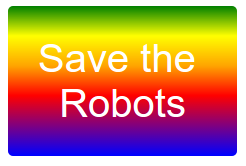

# Introduction {.intro}

In this project, you'll create lots of fun stickers that you can use to decorate web pages. You'll learn about using gradients that gradually change from one colour to another to make your stickers look cool.

# Step 1: Colourful coding sticker {.activity}

A gradient is a gradual change from one colour to another. Gradients can be used to create cool effects. You're going to use them to create stickers that you can use on your web pages.

+ Open this trinket: <a href="http://jumpto.cc/web-stickers" target="_blank">jumpto.cc/web-stickers</a>.

	The project should look like this:

	

+ Let's make an 'I <3 Coding' sticker.

	Use a `
` with a `sticker` class and a `coding` id so that you can style it:

	

+ Hmm did you notice that you got an error? This is because '<' is a special character in HTML. Instead of '<' you need to use the special code `&lt;`.

	Update your code to use `&lt;` so that the error goes away.

	

	` ` gives a new line.

+ Now let's make the sticker look interesting.

	Switch to the `style.css` file. You'll see that the `.sticker` class has been provided for you. This will layout stickers on the page and centre their content.

	Remember that you added the id `coding` to your sticker. At the bottom of `style.css` add the following code to style the text:

	

+ Now you can add a gradient for the background of the sticker. A linear gradient changes from one colour to another along a straight line.

	This gradient will change from red at the top to magenta at the bottom. Add the gradient code to your `coding` style:

	

+ You can improve on the result by adding padding and rounded corners.

	Add the highlighted code:

	

	The `padding` style adds padding of 50px at the top and bottom and 30px on the left and right.

## Save Your Project {.save}

# Step 2: HTML & CSS sticker {.activity}

Gradients can also change colour from the centre out towards the edges, this is called a radial gradient.

+ Let's create a sticker with the text `HTML & CSS.`  `&` is another character that needs encoding in HTML, the code is `&amp;`.

	Add the highlighted code to create a new sticker:

	

+ Now switch to your `style.css` file and add a style for your new sticker:

	

	The `text-shadow` code adds a shadow which extends 2px below and to the right of the text to make it stand out.

+ Now for the gradient. This time let's use a radial gradient. The colour will change from yellow in the centre through to orange and then red.

	

	Notice that gradients can include multiple colours, not just two.

+ The sticker will look much better with some padding and a rounded border.

	Add the highlighted code:

	

## Save Your Project {.save}

##Challenge: Create your own gradient sticker {.challenge}

Now make your own gradient sticker. Try linear and radial gradients using multiple HTML colours.

You'll need to:

+ Add a `
` with your sticker text to `index.html` and give it the `sticker` class and a new `id`.
+ Add style for the `id` you chose in `style.css`. You could copy one of the sticker styles you have already made and edit that.

There’s a list of all the colour names you can use: [jumpto.cc/web-colours](http://jumpto.cc/web-colours), which includes colour names like `tomato`, `firebrick` and `peachpuff`.

If you want to change the text colour you can use `color:`.

Here's an example of what you can do with multiple colours in a linear gradient:

## Save Your Project {.save}

# Step 3: Fancy robot sticker  {.activity}

You can make a gradient sticker using an image. If you use an image with a transparent background then the gradient will show through.

You can also create gradients to run in different directions.

+ Add a sticker to `index.html` using the `firerobot.png` image:

	

	You can adjust the `height` to resize the image, the width will change automatically.

+ Normally a linear gradient runs from top to bottom, but you can use `to` to change the direction. For example: `to top`, `to left`, or `to right`.

	For a diagonal gradient you give two directions. This example uses `to bottom left`.

	Add this style to `style.css` to give your new robot sticker a diagonal gradient and a fancy border:

	

	Note that you can use `outline` to create another border outside the usual one.
	`outline-offset` gives the gap between the border and the outline.

+ Let's add some text to this sticker.

	Add a `` containing the text "ROBOTS" to `index.html` and give it an id.

	

+ The text will look better if you make it bigger and position it.

	To position the text you'll need to add `position: relative;` to `#greensticker` and `position: absolute` to `#greentext`. Positioning is covered in more detail in the `Build a Robot` project.

	Add the following code to `style.css`:

	

+ And for a final twist, let's rotate the text using `transform: rotate`.

	

	Try changing the number of degrees that the text is rotated.

## Save Your Project {.save}

##Challenge: Make more stickers {.challenge}

Now try making more stickers using different gradient directions and adding images and text and using borders and outlines.

Tip: You'll need to add HTML and CSS for each sticker.

You can copy and edit one of your examples and make changes to create a new sticker.

Your project already includes a set of robot images. Click on the images icon to see the available images.

This example uses a linear gradient with `to right`:

## Save Your Project {.save}
