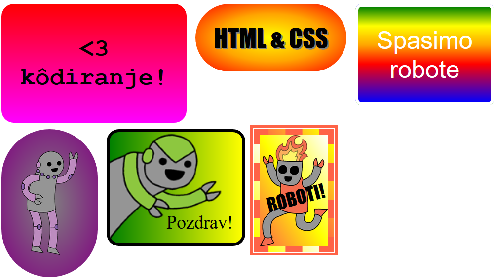
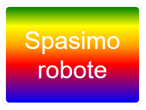
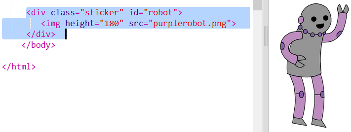
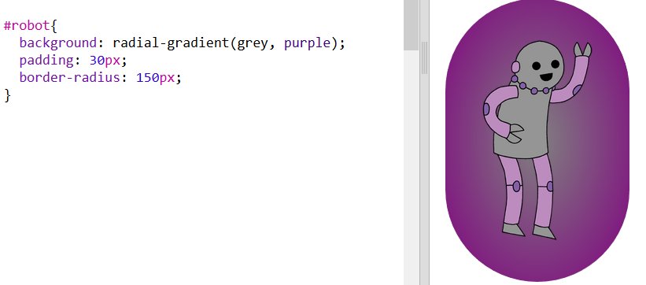
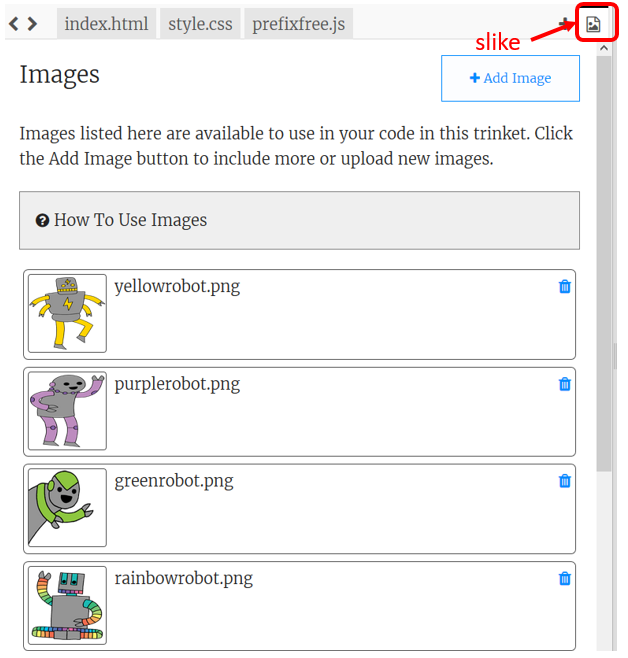
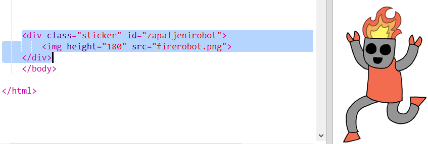
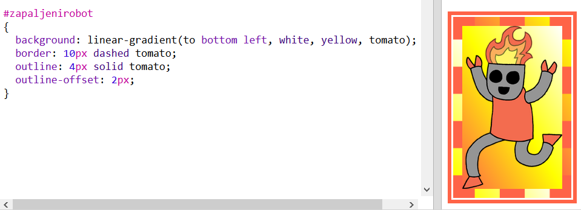
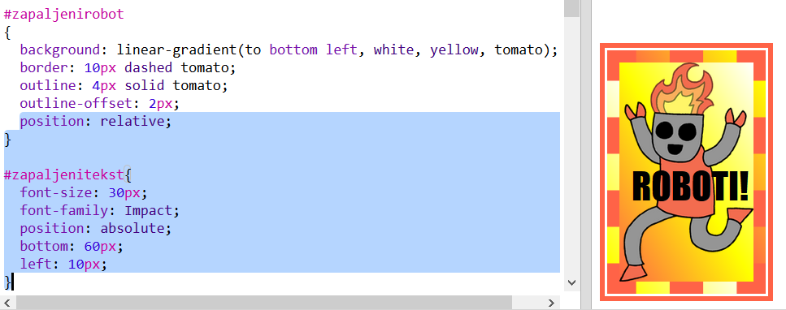
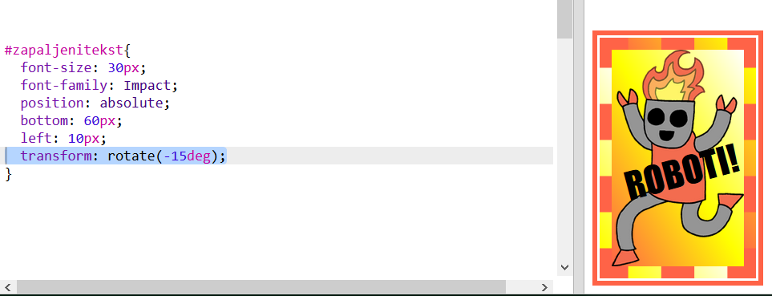
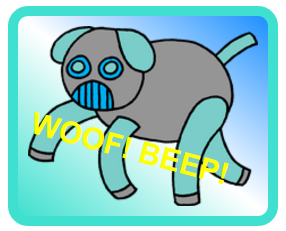

---
title: Naljepnice
level: HTML & CSS 2
language: hr-HR
embeds: "*.png"
materials: ["Club Leader Resources/*.*","Project Resources/*.*"]
stylesheet: web
...

# Uvod {.intro}

U ovom projektu napravit ćeš nekoliko zabavnih naljepnica koje ćeš moći iskoristiti za ukrašavanje svojih web stranica. Učit ćeš koristiti prijelaze (gradaciju) kojima se boje postepeno mijenjaju iz jedne u drugu. 

# Korak 1: Naljepnica s linearnim prijelazom {.activity}

Gradacija ili prijelaz boja je postupna promjena jedne boje u drugu. Može se koristiti za izradu odličnih efekata. Upotrijebit ćemo ju za stvaranje naljepnica koje se mogu koristiti na web stranici.  

+ Otvori sučelje koje se nalazi na poveznici:  <a href="http://jumpto.cc/web-stickers" target="_blank">jumpto.cc/web-stickers</a>. Čitaš li ovo online, možeš koristiti i ugrađenu verziju sučelja za ovaj projekt koja se nalazi ispod ovog teksta. 

  <iframe src="https://trinket.io/embed/html/af0ea6fa35" width="100%" height="400" frameborder="0" marginwidth="0" marginheight="0" allowfullscreen>
  </iframe>

+ Napravimo naljepnicu '<3 kôdiranje'. 

	Za oblikovanje naljepnice koristi oznaku `
` s klasom `sticker` i nazivom (id) `kodiranje`: 

	

+ Primjećuješ li da kôd sadrži pogrešku? To je zbog toga što je znak '<' poseban znak za HTML. Umjesto znaka '<' potrebno je pisati poseban kôd `&lt;`. 

	Promijeni kôd koristeći `&lt;` i poruka o pogrešci će nestati.  

	

	Oznakom ` ` prelaziš u novi red.  

+ Uredimo naljepnicu. 

	Prebaci se u datoteku `style.css`. Vidjet ćeš da klasa `.sticker` već postoji. Ona će prikazati naljepnicu na stranici i postaviti njezn sadržaj na sredinu (centrirati).  

	Sjeti se da smo naljepnici dodali id `kodiranje`. Na kraj datoteke `style.css` dodaj sljedeći kôd za oblikovanje teksta: 

	

+ Sada možeš dodati prijelaz boja pozadini naljepnice. Linearni prijelaz (linear gradient) mijenja jednu boju u drugu uzduž ravne crte. 

	Ovaj prijelaz će mijenjati boju od crvene na vrhu do boje ciklame (magenta) na dnu. Dodaj kôd za prijelaz boja stilu `kodiranje`:

	

+ Rezultat možeš promijenti dodavanjem razmaka (padding) i zaobljenih uglova.   

	Dodaj označeni kôd:

	

	`padding` dodaje razmak od 50 piksela od elemenata s gornje i donje strane, a 30 piksela od elemenata lijevo i desno.  

## Spremi projekt {.save}

# Korak 2: Naljepnica s radijalnim prijelazom {.activity}

Gradient također može mijenjati boju od sredine prema rubovima. To nazivamo radijalna gradacija ili radijalni prijelaz. 

+ Napravimo naljepnicu s tekstom `HTML & CSS.`  `&` je još jedan znak za koji u HTML-u trebamo poseban kôd. Kod za `&` je `&amp;`.

	Dodaj istaknuti kôd za izradu nove naljepnice: 

	

+ Prebaci se u datoteku `style.css` i dodaj oblikovanje za svoju novu naljepnicu: 

	

	Kôd `text-shadow` dodaje sljenu koja se proteže 2 piksela ispod i desno od teksta kako bi ga istaknula.  

+ Sada je na redu prijelaz boja. Ovaj puta koristit ćemo radijalni prijelaz. Boja će se mijenjati od žute u centru preko narančaste do crvene. 

	

	Primijeti da prijelaz može uključiti više boja, ne samo dvije. 

+ Naljepnica će izgledati bolje ako joj dodamo 'padding' i zaoblimo rubove. 

	Dodaj istaknuti kôd:

	

## Spremi promjene u projektu {.save}

##Izazov: Napravi svoju obojanu naljepnicu {.challenge}

Napravi sada svoju obojanu naljepnicu. Iskušaj i linearni i radijalni prijelaz koristeći više boja. 

Trebat ćeš:

+ U datoteku `index.html` dodati oznaku `
` koja sadrži tekst za naljepnicu. Oznaci `
` dodaj klasu `sticker` i novi `id`.
+ Dodaj oblikovanje za odabrani `id` u datoteku `style.css`. Možeš kopirati jedno od već gotovih oblikovanja i urediti ga.  

Ovdje se nalazi popis svih boja koje možeš koristiti: [jumpto.cc/web-colours](http://jumpto.cc/web-colours).

Želiš li promijeniti boju teksta koristi `color:`.

Pogledaj  što možeš napraviti s više boja koristeći linearni prijelaz: 

## Spremi promjene u projektu{.save}

# Korak 3: Naljepnica sa slikom  {.activity}

Moguće je izraditi i naljepnice s prijelazom boja koje sadrže slike. Da bi se prijelaz prikazao potrebno je koristiti sliku s prozirnom pozadinom. 

+ Napravimo najprije naljepnicu sa slikom. 

	Projekt već sadrži sliku naziva `purplerobot.png`.

	Dodaj istaknuti kôd datoteci `index.html`:

	

	Za promjenu veličine slike možeš iskoristiti `height`. On će promijeniti visinu slike, a širina će se automatski prilagoditi. 

+ Dodajmo sada kôd za oblikovanje kako bi kreirali pozadinu s prijelazom boja: 

	

## Spremi promjene u projektu {.save}

##Izazov: Napravi svoju naljepnicu sa slikom {.challenge}

Napravi svoju naljepnicu sa slikom i prijelazom boja u pozadini. 

Trebat ćeš:

+ U datoteku `index.html` dodati novu oznaku `
` koja uključuje sliku.  
+ Oznaci `
` dodati klasu `sticker` i novi id.
+ Izraditi stil za novi id koji uključuje prijelaz boja (gradient) i razmak (padding). 

U projekt je već uključena serija slika s robotima. Klikni na ikonu za dodavanje slika i provjeri dostupne slike. 

Pogledaj primjer naljepnice sa slikom i linearnim prijelazom: 

## Spremi promjene u projektu {.save}

# Korak 4:Horizontalni prijelazi boja  {.activity}

Prijelaz boja može biti horizontalan ili vertikalan.  

+ Napravimo još jednu naljepnicu sa slikom.  

	Ovaj puta koristit ćemo sliku `greenrobot.png`. Dodaj sljedeći kôd u datoteku `index.html`:

	

+ Obično linearni prijelaz kreće od vrha prema dnu, ali dodamo li `to right` možemo postići da promjena boja ide s lijeva na desno.  

	Dodaj istaknuti kôd u datoteku `style.css`. Njime ćeš naljepnici dodati horizontalni prijelaz boja. 

	

	Primijeti da prijelaz kreće od zelene boje s lijeve strane do žute na desnoj strani. 

+ Ovaj robot izgleda kao da želi nešto reći. Dodajmo naljepnici i malo teksta. 

	Vrati se u `index.html` datoteku i naljepnici sa zelenim robotom  dodaj tekst 'Pozdrav!'. Postavi ga unutar oznake `` i dodaj mu id, tako da ga naknadno možeš i oblikovati:  

	

+ Tekst će izgledati bolje ako ga povećaš i premjestiš. 

	Za premještanje teksta trebaš dodati `position: relative;` u oblikovanje `#zeleni robot` i `position: absolute` u `#zelenitekst`. Taj dio je detaljnije objašnjen u projektu `Napravi robota`. 

	Dodaj istaknuti kôd u datoteku `style.css`:

	

	Sada je tekst 'Pozdrav!' postavljen relativno prema donjem desnom kutu naljepnice. 

## Spremi promjene u projektu {.save}

# Korak 5: Dijagonalni prijelaz  boja {.activity}

Možeš kreirati i dijagonalni prijelaz boja koji se kreće od jednog do drugog kuta. 

+ Dodaj novu naljepnicu u datoteku `index.html`. Iskoristi sliku `firerobot.png`:

	

+ Prilikom definiranja dijagonalnog prijelaza navode se dva smjera. U primjeru je korišten smjer `to bottom left` (dolje lijevo).

	Dodaj sljedeće oblikovanje u datoteku `style.css`. Njime ćeš naljepnici dodati dijagonalni prijelaz i simpatičan okvir. 

	

	Primijeti da možeš koristiti `outline` za dodavanje još jednog okvira izvan uobičajenog.  
	`outline-offset` dodaje prazninu između ta dva okvira.  

+ Dodajmo tekst na naljepnicu. 

	U kôd za naljepnicu u datoteci `index.html` dodaj oznaku `` koja sadrži tekst "ROBOTI!".

	

+ Sada pozicioniraj tekst dodavanjem sljedećeg oblikovanja: 

	

+ Za kraj, koristeći `transform: rotate` zarotirajmo tekst na naljepnici.

	

	Mijenjaj broj stupnjeva i rotiraj tekst po želji. 

## Spremi promjene u projektu {.save}

##Izazov: Napravi više naljepnica {.challenge}

Pokušaj napraviti više naljepnica koristeći različit smjer prijelaza boja, dodavanjem slika i teksta, te korištenjem okvira. 

Možeš kopirati jedan od gotovih primjera i u njemu napraviti promjene. 

Pogledaj primjer: 

## Spremi projekt {.save}
