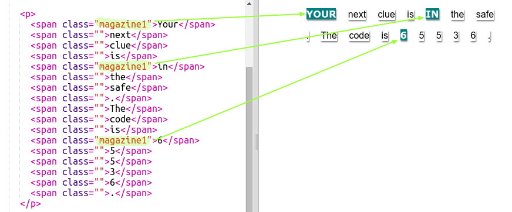
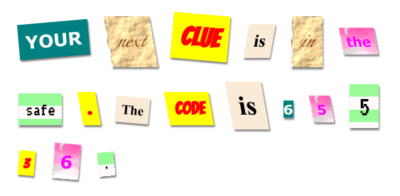

# Introduzione {.intro}

In questo progetto, creerai una lettera misteriosa dove sembrerà che ogni parola sia stata tagliata da un diverso quotidiano, rivista, fumetto o altra fonte.

# Passo 1: Scegli il messaggio {.activity}

Le lettere misteriose sono utilizzate in film e libri per inviare messaggi segreti.

## Lista di controllo delle attività { .check}

+ Pensa a un messaggio misterioso di 12 parole circa. Se non riesci a pensare a un messaggio, puoi utilizzare questo esempio: "Il prossimo indizio è nella cassaforte. Il codice è 65536."

+ Prendi nota del messaggio o ricordalo.

# Passo 2: Modifica del messaggio {.activity}

Inseriamo il messaggio in una pagina Web.

## Lista di controllo delle attività { .check}

+ Apri questo trinket: <a href="http://jumpto.cc/web-letter" target="_blank">jumpto.cc/web-letter</a>.

	Il progetto si presenta così:

	

+ Nel progetto "Buon compleanno", abbiamo introdotto il tag `
` per il paragrafo. Il tag `` è utilizzato per raggruppare parti più piccole di testo all’interno di un paragrafo in modo da poter attribuir loro uno stile.

## Lista di controllo delle attività { .check}

+ Modifica le parole del messaggio inserendo una parola in ciascun ``. Dovrai aggiungere o rimuovere i tag `` nel caso in cui il tuo messaggio sia di una lunghezza diversa.

## Lista di controllo delle attività { .check}

+ Fai clic sul pulsante Run (Esegui) per verificare il trinket.

	Se osservi le parole, vedrai che è stato attribuito loro uno stile come se fossero state incollate sulla pagina.

# Passo 3: Utilizzo degli stili di classe {.activity}

## Lista di controllo delle attività { .check}

+ Hai notato la dicitura `class=""` nei tag ``? Puoi utilizzare questa proprietà per attribuire uno stile a più elementi nello stesso modo.

+ Aggiungi la classe `magazine1` ad alcuni dei tag `` e verifica la pagina Web.

## Lista di controllo delle attività { .check}

+ È possibile aggiungere più di una classe a un elemento. Basterà lasciare uno spazio al centro. Aggiungi la classe `big` a uno dei tag ``. Verifica la pagina.

## Salva il progetto {.save}

## Sfida: Attribuisci uno stile al messaggio {.challenge}

Utilizza gli stili forniti in modo che il messaggio sembri una lettera misteriosa.

Aggiungi queste classi ai tag ``:

+ `newspaper`, `magazine1`, `magazine2`

+ `medium`, `big`, `reallybig`

+ `rotateleft`, `rotateright`

+ `skewleft`, `skewright`

Per ogni ``, scegli solamente una delle classi per riga.

Ecco come potrebbe apparire la tua lettera:

## Salva il progetto {.save}

# Passo 4: Modifica delle classi {.activity}

## Lista di controllo delle attività { .check}

+ Fai clic sulla scheda __"style.css"__. Individua lo stile della classe CSS `newspaper` che hai utilizzato.

+ Nota che è presente un punto '.' prima del nome della classe nel file CSS ma non nel tag `` del documento HTML.

+ Ora osserva le altre classi CSS che hai utilizzato per attribuire uno stile alla lettera misteriosa. Riesci a trovare:

	+ Come lo stile `magazine1` cambi il testo in modo che tutte le lettere siano in maiuscolo.

	+ Come lo stile `magazine2` consenta di inserire un’immagine dietro al testo.

+ Cosa succede se modifichi la `background-image` di `magazine2` con `canvas.png`? Se preferisci `pink-pattern.png`, puoi sempre ripristinarla.

Puoi anche modificare i colori negli stili della rivista se vuoi.

+ Trova il CSS utilizzato per ruotare e inclinare le parole:

Prova a cambiare i numeri per creare diversi effetti e verifica la pagina.

# Passo 5: Creazione di una nuova classe {.activity}

Creiamo uno stile che sembri essere stato ritagliato da un fumetto. <a href="http://jumpto.cc/web-fonts" target="_blank">jumpto.cc/web-fonts</a> offre moltissimi caratteri che possono essere utilizzati gratuitamente.

## Lista di controllo delle attività { .check}

+ Aggiungi la classe `comic` nel file __style.css__. La posizione ideale sarebbe dopo `magazine2`. Non dimenticare il punto davanti al nome della classe.

Non ti preoccupare se appare la scritta "The Rule is empty" (La regola è vuota); risolverai dopo il problema.

+ Ora aggiungi codice CSS alla classe CSS comic. Se vuoi, puoi utilizzare diversi colori. C’è un elenco con moltissimi colori su <a href="http://jumpto.cc/colours" target="_blank">jumpto.cc/colours</a>.

+ Utilizza lo stile comic per alcuni dei tag `` del documento HTML e verifica la pagina:

+ Aggiungi adesso un carattere divertente. Apri una nuova finestra o scheda del browser. Vai a <a href="http://jumpto.cc/web-fonts" target="_blank">jumpto.cc/web-fonts</a> e cerca __"bangers"__:

+ Fai clic sul pulsante Quick-use (Utilizzo rapido):

+ Si caricherà una nuova pagina. Scorri verso il basso finché non vedrai:

e copia il codice evidenziato.

+ Incolla il codice `<link>` che hai appena copiato da Google Fonts nel tag `<head>` della pagina Web:

In tal modo, potrai utilizzare il carattere Bangers nella pagina Web.

+ Torna a Google Fonts, scorri più in basso e copia il codice font-family:

+ Torna ora al file __"style.css”__ in trinket e incolla il codice font-family nello stile comic:

+ Verifica la pagina Web. Il risultato dovrebbe essere simile a:

## Salva il progetto {.save}

## Sfida: Crea lo stile di una stampa dal computer {.challenge}

Crea lo stile di una tradizionale stampa dal computer e applicalo ad alcune parole:

Ti servirà:

+ La famiglia di caratteri `VT323` da <a href="http://jumpto.cc/web-fonts" target="_blank">jumpto.cc/web-fonts</a>. Rivedi il Passo 5 se non ti ricordi come utilizzare Google Fonts.

+ L’immagine di sfondo `computer-printout-paper.png`. Rivedi il Passo 4 se non ti ricordi come utilizzare le immagini di sfondo. 	

## Sfida: Crea i tuoi stili personali {.challenge}

Crea adesso i tuoi personali stili di classe per rendere ancora più interessante la lettera misteriosa. Utilizza il CSS appreso nei progetti precedenti e guarda gli esempi inclusi in __style.css__ per farti venire qualche idea.

Ecco un esempio:

Puoi visualizzare le immagini utilizzabili facendo clic sulla scheda Images (Immagini) di trinket.
Prova a impostare l’immagine di sfondo utilizzando una delle immagini incluse:

+ `rough-paper.png`

+ `canvas.png`

Se hai un account su Trinket, puoi caricare le tue immagini seguendo la stessa procedura del progetto "Racconta una storia".

Trova i caratteri che ti piacciono su <a href="http://jumpto.cc/web-fonts" target="_blank">jumpto.cc/web-fonts</a> e copia il codice `<link>` e CSS nel tuo trinket per utilizzarli.

## Salva il progetto {.save}
